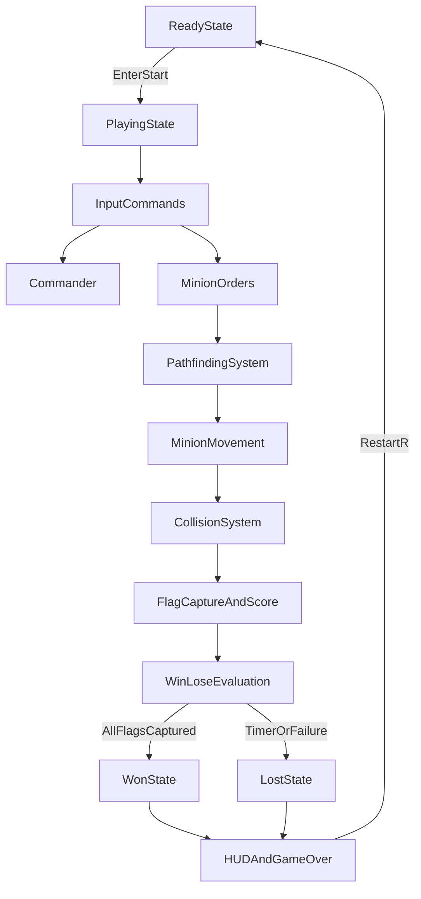

# Game Concept Integration

## Goal

Ship a complete playable build where the user can start a match, issue commands, earn points through objective play, and reach deterministic win/lose states with clear game-over messaging.

## What Already Exists (to leverage)

- Core game shell and camera/minimap flow in `[/cdv/apps/algorithmic-arena/src/Game.cpp](/cdv/apps/algorithmic-arena/src/Game.cpp)`.
- Entity setup and spawning foundations in `[/cdv/apps/algorithmic-arena/src/Entities/PlayerCommander.cpp](/cdv/apps/algorithmic-arena/src/Entities/PlayerCommander.cpp)` and `[/cdv/apps/algorithmic-arena/src/Entities/Minion.cpp](/cdv/apps/algorithmic-arena/src/Entities/Minion.cpp)`.
- Objective map semantics (`Flag`, `Deploy`, entrances, commander start) in `[/cdv/apps/algorithmic-arena/src/World/MapLoader.cpp](/cdv/apps/algorithmic-arena/src/World/MapLoader.cpp)` and capture state helpers in `[/cdv/apps/algorithmic-arena/src/World/TileMap.cpp](/cdv/apps/algorithmic-arena/src/World/TileMap.cpp)`.
- Collision/pathfinding algorithm switching already wired in `[/cdv/apps/algorithmic-arena/src/Game.cpp](/cdv/apps/algorithmic-arena/src/Game.cpp)`.

## Integration Plan

### 1) Add explicit game phases and round bootstrap

- Extend `GameState` usage in `[/cdv/apps/algorithmic-arena/src/Game.h](/cdv/apps/algorithmic-arena/src/Game.h)` beyond declaration: `Ready`, `Playing`, `Won`, `Lost`.
- Add a `startMatch()` initializer in `[/cdv/apps/algorithmic-arena/src/Game.cpp](/cdv/apps/algorithmic-arena/src/Game.cpp)` to reset timers, score, objective progress, and transient input cooldowns.
- Bind a clear start action (e.g. `Enter`) in `processEvents()` so the user explicitly starts gameplay from `Ready`.

### 2) Implement command and game flow loop

- Add order input in `[/cdv/apps/algorithmic-arena/src/Game.cpp](/cdv/apps/algorithmic-arena/src/Game.cpp)`:
  - `Space`: spawn minion (already present, retain deploy-zone restriction).
  - `Right-click` or key-trigger: issue target objective tile to all/selected minions via `Minion::setTarget`.
  - Optional: cycle objective focus (`F`) should also support minion order assignment.
- Keep commander as control unit and camera anchor; ensure control remains responsive during all `Playing` frames.

### 3) Build scoring + capture progression from flag tiles

- Reuse `TileMap::advanceCapture/getCaptureProgress/isCaptured` in `[/cdv/apps/algorithmic-arena/src/World/TileMap.cpp](/cdv/apps/algorithmic-arena/src/World/TileMap.cpp)` by updating capture each frame for minions on `Flag` tiles.
- Add gameplay stats in `[/cdv/apps/algorithmic-arena/src/Game.h](/cdv/apps/algorithmic-arena/src/Game.h)`:
  - `score_`, `capturedFlags_`, `totalFlags_`, `activeObjective_` (optional).
- Define point rules (e.g. per flag capture + per-second survival/bonus) and update only while `Playing`.

### 4) Enforce win/lose conditions and end-of-game behavior

- Win condition: all map flags captured.
- Lose condition: mission timer exceeded (`timeLimitSeconds_`) or no viable minions after initial deployment window.
- Freeze command/spawn updates after terminal state and show deterministic end screen text in `[/cdv/apps/algorithmic-arena/src/Game.cpp](/cdv/apps/algorithmic-arena/src/Game.cpp)`.
- Add quick restart path (`R`) that re-runs `startMatch()` without restarting the process.

### 5) Add HUD for player clarity (start, points, objectives, timer, game-over)

- Add a lightweight UI overlay (in `Game` initially) rendered in default view with:
  - Current phase (`Ready/Playing/Won/Lost`)
  - Score
  - Captured flags / total flags
  - Remaining mission time
  - Input hints (`Enter`, `Space`, objective order, `R`)
- If font asset loading is unavailable, add fallback minimal rectangles/indicators and log warning.

### 6) Validation pass: make it "clearly playable"

- Manual acceptance checks:
  - Match starts from explicit ready state.
  - Player can spawn and command minions.
  - Flag capture progresses and score changes.
  - Timer and/or objective outcomes trigger win/lose.
  - End-state message is visible and restart works.
- Run build and smoke test both algorithm modes to ensure gameplay flow is independent of chosen collision/pathfinding implementation.

## Data Flow (Target)

## Primary Files To Change

- `[/cdv/apps/algorithmic-arena/src/Game.h](/cdv/apps/algorithmic-arena/src/Game.h)`
- `[/cdv/apps/algorithmic-arena/src/Game.cpp](/cdv/apps/algorithmic-arena/src/Game.cpp)`
- `[/cdv/apps/algorithmic-arena/src/Entities/Minion.h](/cdv/apps/algorithmic-arena/src/Entities/Minion.h)`
- `[/cdv/apps/algorithmic-arena/src/Entities/Minion.cpp](/cdv/apps/algorithmic-arena/src/Entities/Minion.cpp)`
- (Optional small adjustments) `[/cdv/apps/algorithmic-arena/src/World/TileMap.h](/cdv/apps/algorithmic-arena/src/World/TileMap.h)`, `[/cdv/apps/algorithmic-arena/src/World/TileMap.cpp](/cdv/apps/algorithmic-arena/src/World/TileMap.cpp)`

## Definition of Done

- User can complete a full match loop without ambiguity: Start -> command/spawn -> score progress -> Win/Lose -> Restart.
- All required game elements are visible in-game: points, timer, objective progress, and final outcome state.
- No regressions to existing map loading, minimap, or algorithm mode toggles.

